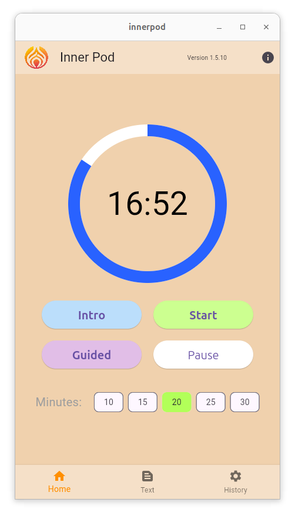

# InnerPod - A Meditation Timer and Session Log

**A Togaware app using Solid Pods**

**An ANU Software Innovation Institute demo project for Solid Pods**

*Author: Graham Williams*

*[ANU Software Innovation Institute](https://sii.anu.edu.au)*

*[Togaware](https://togaware.com.au)*

*License: GNU GPL V3*

## Quick Start

To run the app **now* visit https://innerpod.solidcommunity.au. To
install the app on your desktop or mobile device, visit
[Installers](https://github.com/gjwgit/innerpod/blob/dev/installers/README.md).

Contributions are welcome. Visit the [github
repository](https://github.com/gjwgit/innerpod) and feel free to
submit an issue, or, even better, fork the repository yourself, update
the code, and submit a Pull Request. Thanks.

## Introduction

InnerPod is a session timer with sessions optionally logged to your
[Solid Pod](https://solidproject.org/about). A session can be anything
though the app is commonly used for silent meditation.

## Using the App

A login screen is displayed on startup. Logging in is optional and
only required if you wish to record your session to your Solid Pod. To
continue without capturing any data simply tap **SESSION**. The
session timer is fully functional without a connection and no data is
collected or stored.

To record your sessions the tap on **LOGIN** to connect to your Solid
Pod., If you yet to have a WebID and a Solid Pod then you can
**REGISTER** to sign up for your personally private Solid Pod hosted,
for example, on https://pods.solidcommunity.au. All data is encrypted
on the Pod and only you have access to the data on your device, unless
you explicitly share the data.

After tapping on **LOGIN** the app will establish a connection to your
Solid Pod. Once a connection is made then the session will be logged
and previous sessions will be available for visualising.

Tap on the **INFO** button to review this guide.

Once you connect to the app the session manager displays a countdown
timer and buttons to interact and manage the session. 

A silent meditation session begins with the sounding of a bell and
finishes with the same bell. 

Pushing the green **Start** button will simply initiate a 20 minute session
(or however long you have chosen using the Chips at the bottom of the
screen).

Pushing the blue **Intro** button plays a short opening in preparation
for the meditation.

Pushing the purple **Guided** button plays an introductory guide to
meditating from [John Main](https://en.wikipedia.org/wiki/John_Main),
following by a short musical chant as you prepare yourself for the
meditation session. At the conclusion another short musical interlude
is played as you emerge from the silence of your meditation. This is
particularly handy in a group meditation session.

## The App Itself

The app is written in
[Flutter](https://survivor.togaware.com/gnulinux/flutter.html) and the
open source code is available from
[github](https://github.com/gjwgit/innerpod).

You can try it out online at https://innerpod.solidcommunity.au. We
also welcome testers of the Android app at
https://play.google.com/store/apps/details?id=com.togaware.innerpod

## Acknowledgements

The app was implemented by [Graham
Williams](https://togaware.com/graham.williams.html) using [Solid Pod
libraries](https://github.com/anusii/solidpod) developed by the ANU's
[Software Innovation Institute](https://sii.anu.edu.au).

The graphics (login page picture and logo/icon) were generated using
Microsoft's Designer
(https://designer.microsoft.com/image-creator). The audio was
generated using ElevenLabs text to speech.

The instructions for meditating by John Main are from
[WCCM](https://wccm.org).

