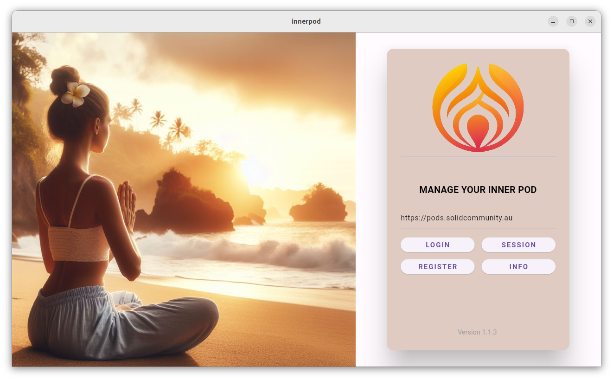
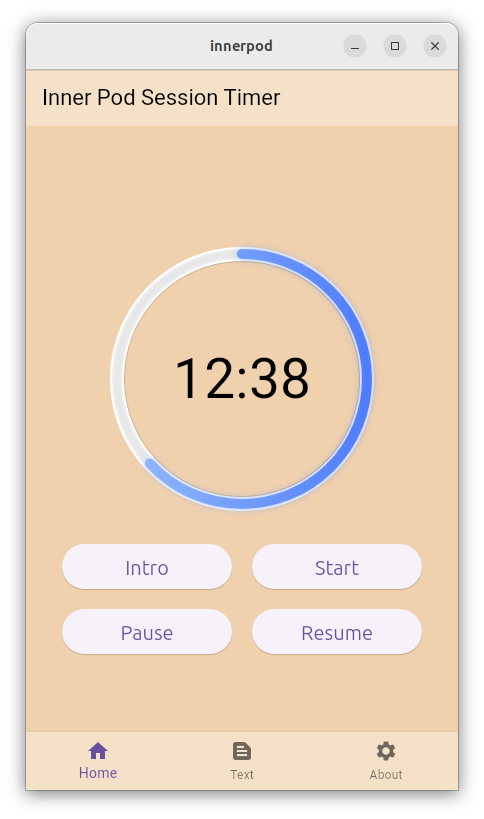

# InnerPod

**A Togaware app using Solid Pods**

*Author: Graham Williams*

*[Togaware](https://togaware.com.au)*

*License: GNU GPL V3*

Contributions are welcome. From the github repository feel free to
	fork, update and submit a Pull Request.

## Introduction

InnerPod is a session timer with sessions optionally logged to your
[Solid Pod](https://solidproject.org/about). A session can be anything
though the app is commonly used for silent meditation.

## Using the App

A login screen is displayed on startup. Logging in is optional and
only required if you wish to record your session to your Solid Pod. To
continue without capturing any data simply tap **SESSION**. The
session timer is fully functional without a connection and no data is
collected or stored.

To record your sessions the tap on **LOGIN** to connect to your Solid
Pod., If you yet to have a WebID and a Solid Pod then you can
**REGISTER** to sign up for your personally private Solid Pod hosted,
for example, on https://pods.solidcommunity.au. All data is encrypted
on the Pod and only you have access to the data on your device, unless
you explicitly share the data.

After tapping on **LOGIN** the app will establish a connection to your
Solid Pod. Once a connection is made then the session will be logged
and previous sessions will be available for visualising.

Tap on the **INFO** button to review this guide.

Once you connect to the app the session manager displays a countdown
timer and buttons to interact and manage the session. 

When a silent meditation session begins three dings are donged. The
three dings get donged again at the end of the session. 

The **START** button will simply initiate a 20 minute session.

The **INTRO** button plays a short guide on how to meditate from [John
Main](https://en.wikipedia.org/wiki/John_Main).

## The App Itself

The app is written in
[Flutter](https://survivor.togaware.com/gnulinux/flutter.html) and the
open source code is available from
[github](https://github.com/gjwgit/innerpod).

You can try it out online at https://innerpod.solidcommunity.au. We
also welcome testers of the Android app at
https://play.google.com/store/apps/details?id=com.togaware.innerpod

## Acknowledgements

The app was implemented by [Graham
Williams](https://togaware.com/graham.williams.html) using [Solid Pod
libraries](https://github.com/anusii/solidpod) developed by the ANU's
[Software Innovation Institute](https://sii.anu.edu.au).

The graphics (login page picture and logo/icon) were generated using
Microsoft's Designer
(https://designer.microsoft.com/image-creator). The audio was
generated using ElevenLabs text to speech.

The instructions for meditating by John Main are from
[WCCM](https://wccm.org).

