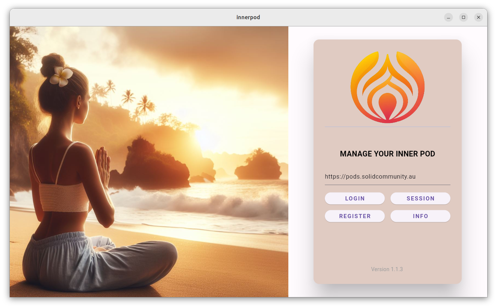
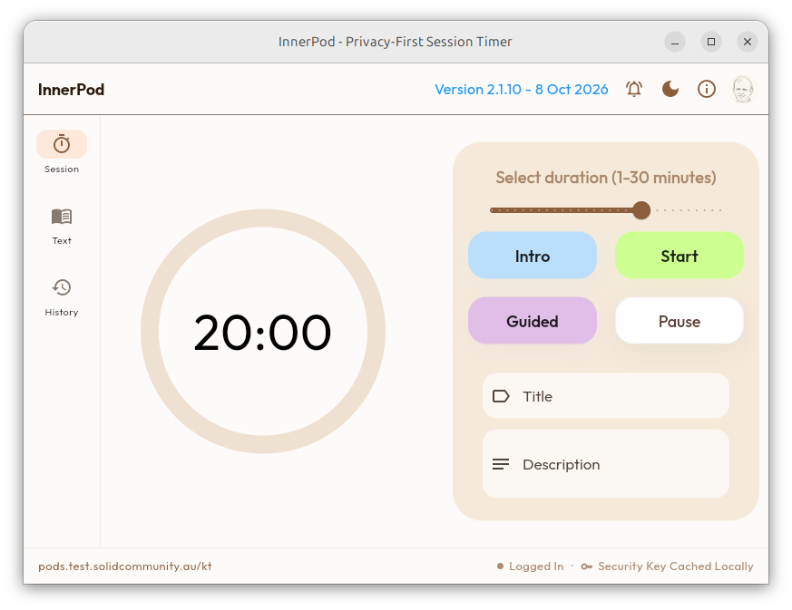
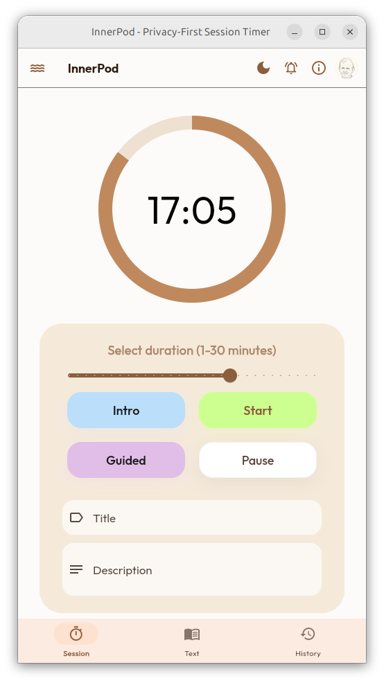

# InnerPod - Privacy-First Session Timer

Privacy-first: your data is encrypted for secure and private storage
in your Pod on a Solid server of your choice. You choose, not us.

[InnerPod](https://gjwgit.github.io/radiopod/) provides a timer for
your sessions. It has been designed to support meditation session but
can support any regular timed session. Tap **Start** for a session to
start and end with three bells. Tap **Intro** for a short audio intro
to the session before the bells. Tap **Guided** for instructions on
meditation, and then some soothing music for before and after the
bells.

Your history of sessions are stored locally by default. Once you are
ready the history data can be encrypted and privately stored in your
own personal online data store ([Pod](https://solidproject.org/about))
within a Data Vault hosted by a Solid Server of your choice.
Pod-stored data is available on any of your devices to share your
history while being protected against server administrator access and
server breaches.

Solid Pods are a new approach to handling your personal data on the
World Wide Web and is the latest innovation from the inventor of the
WWW, Sir Tim Berners-Lee. Obtain a Pod for yourself on any Solid
server and link it to your app. **You do not need a Solid Pod to use
this app in local-only mode.** If you would like to register for a new
Pod on a Solid server, choose a server and tap the **Register** button
on the **Login** screen (tap Logged Out in the footer or in the top
left menu drawer). You will be prompted for an email address (username) a
password, and a pod name. On logging in to your Pod for the first time
you will be asked for a security key to protect your data on the
server.

The app is supported by [Togaware](https://togaware.com) and and
implemented by [Graham
Williams](https://togaware.com/Graham.Williams.html) using
[Flutter](https://flutter.dev)'s
[SolidUI](https://github.com/anusii/solidui) package for cross
platform development..

We make this project available for free so if you appreciate the app
then please show some ❤️ and tap on the star at
[GitHub](https://github.com/gjwgit/radiopod) to support our work. See
the [AU Solid Community](https://solidcommunity.au) **showcase** for
many more apps using the Solid ecosystem.

## Features

+ An audio **Guide** to meditation.
+ A mediation session is begun and concluded with three **Bells**. You
  have a choice of appropriate **Bells**.
+ A **Countdown Timer** defaults to 20 minutes with a choice of any
  time up to 30 minutes.
+ Session **History** with title and notes is recorded. If conencted
  to your Solid server the history is securely and privately shared
  between your app running on any device.
+ **Dark/Light** modes are supported.
+ Runs on **Android, iOS, GNU/Linux, macOS, Windows and the web**.

## Privacy

InnerPod is built to protect your privacy. The app maintains a history
of your sessions. In **local-only** mode (default) all data remains on
your device. When you **Login** to a Solid server hosting your Pod,
your history is stored in your Pod and is accessible to your app running
on any device through your security key. The security key is used to
decrypt the data on your device so it is not accessible by anyone on
the server. Your Solid server of choice may collect your login
timestamp and other standard server logging of meta data.

## Installation

You can install the released version of the app from different
repositories including:

+ [Google Play
Store](https://play.google.com/store/apps/details?id=com.togaware.innerpod)
for Android;
+ [SnapCraft](https://snapcraft.io/innerpod) for Linux.

The latest version of the app can be run online at
[innerpod.solidcommunity.au](https://innerpod.solidcommunity.au) with
no installation required, or downloaded and installed for your
platform from the [Solid Community AU](https://solidcommunity.au)
repository:

+ **Web**
  [solidcommunity](https://innerpod.solidcommunity.au/);
+ **Android**
  [apk](https://solidcommunity.au/installers/innerpod.apk);
+ **GNU/Linux**
  [snap](https://solidcommunity.au/installers/innerpod_amd64.snap) or
  [deb](https://solidcommunity.au/installers/innerpod_amd64.deb) or
  [zip](https://solidcommunity.au/installers/innerpod-linux.zip);
+ **macOS**
  [dmg](https://solidcommunity.au/installers/innerpod-macos.dmg) or
  [zip](https://solidcommunity.au/installers/innerpod-macos.zip);
+ **Windows**
  [zip](https://solidcommunity.au/installers/innerpod-windows.zip) or
  [exe](https://solidcommunity.au/installers/innerpod-windows-inno.exe).

Contributions are welcome. Visit
[github](https://github.com/gjwgit/innerpod) to submit an issue or,
even better, fork the repository yourself, update the code, and submit
a Pull Request. The app is implemented in
[Flutter](https://flutter.dev). Thanks.

## Using the App

A login screen is displayed on startup. Logging in is optional and
only required if you wish to record your session to your Solid Pod. To
continue without capturing any data simply tap **SESSION**. The
session timer is fully functional without a connection and no data is
collected or stored.

To record your sessions the tap on **LOGIN** to connect to your Solid
Pod., If you yet to have a WebID and a Solid Pod then you can
**REGISTER** to sign up for your personally private Solid Pod hosted,
for example, on [Solid Community AU
Pods](https://pods.solidcommunity.au). All data is encrypted on the
Pod and only you have access to the data on your device, unless you
explicitly share the data.

After tapping on **LOGIN** the app will establish a connection to your
Solid Pod. Once a connection is made then the session will be logged
and previous sessions will be available for visualising.

Tap on the **INFO** button to review this guide.

Once you connect to the app the session manager displays a countdown
timer and buttons to interact and manage the session. As the timer
progresses, the circular progress bar is empties of the blue bar,
providing a visual cue that the session and audio are active.

A silent meditation session begins with the sounding of a bell and
finishes with the same bell.

Pushing the green **Start** button will simply initiate a 20 minute session
(or however long you have chosen using the Chips at the bottom of the
screen).

Pushing the blue **Intro** button plays a short opening in preparation
for the meditation.

Pushing the purple **Guided** button plays an introductory guide to
meditating from [John Main](https://en.wikipedia.org/wiki/John_Main),
following by a short musical chant as you prepare yourself for the
meditation session. At the conclusion another short musical interlude
is played as you emerge from the silence of your meditation. This is
particularly handy in a group meditation session.

The interface is fully adaptive to the screen size and works just as
well on mobile devices.

## The App Itself

The app is written in
[Flutter](https://survivor.togaware.com/gnulinux/flutter.html) and the
open source code is available from
[github](https://github.com/gjwgit/innerpod). We utilise the
[solidpod](https://pub.dev/packages/solidpod) package for Flutter.

You can try it out online at [Solid Community
AU](https://innerpod.solidcommunity.au). We also welcome testers of
the [Android
app](https://play.google.com/store/apps/details?id=com.togaware.innerpod).

For more information on the Solid project visit the [Solid Project
AU](https://solidproject.org) site.

## Acknowledgements

The app was implemented by [Graham
Williams](https://togaware.com/graham.williams.html) using [Solid Pod
libraries](https://github.com/anusii/solidpod) developed by the ANU's
[Software Innovation Institute](https://sii.anu.edu.au).

The graphics (login page picture and logo/icon) were generated using
Microsoft's
[Designer](https://designer.microsoft.com/image-creator). The audio
was generated using ElevenLabs text to speech.

The instructions for meditating by John Main are from
[WCCM](https://wccm.org).

The bells were generated by Anthropic's Claude.

## Contributing

Feel free to pickup tasks from the list in Issues and so create a fork
to work on the issue to then submit a pull request. Or else contact
<innerpod@togaware.com> to volunteer to work directly on the project
under out guidance.

Time-stamp: <Thursday 2026-10-08 09:28:00 +1100 Graham Williams>

<!-- markdownlint-disable MD053 -->
[comment]: # (Local Variables:)
[comment]: # (time-stamp-line-limit: -8)
[comment]: # (End:)
<!-- markdownlint-enable MD053 -->
